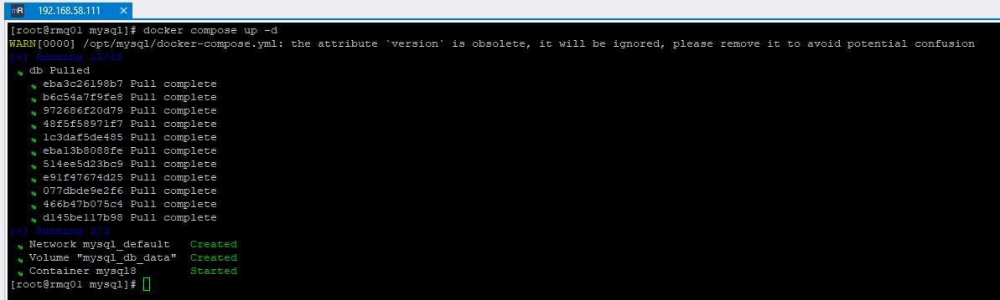
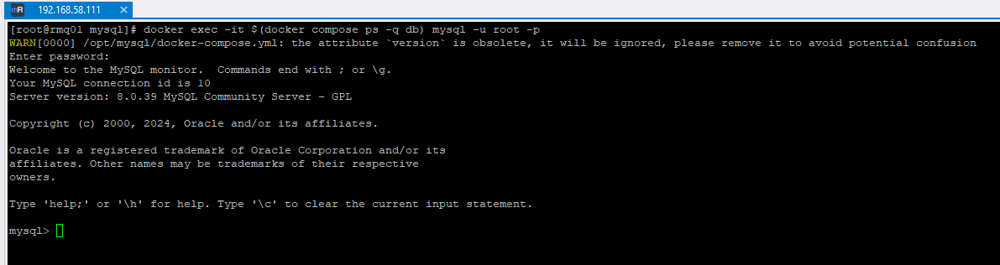
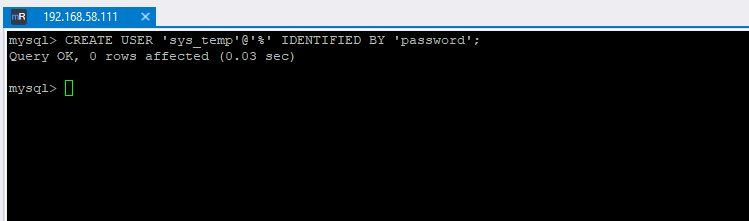
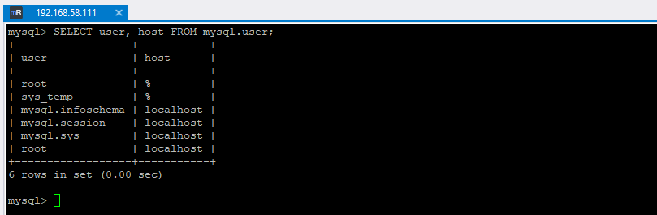

# Домашнее задание к занятию "`DDL/DML`" - `Дедюрин Денис`

---
## Задание 1
1.1. Поднимите чистый инстанс MySQL версии 8.0+. Можно использовать локальный сервер или контейнер Docker.

1.2. Создайте учётную запись sys_temp.

1.3. Выполните запрос на получение списка пользователей в базе данных. (скриншот)

1.4. Дайте все права для пользователя sys_temp.

1.5. Выполните запрос на получение списка прав для пользователя sys_temp. (скриншот)

1.6. Переподключитесь к базе данных от имени sys_temp.

Для смены типа аутентификации с sha2 используйте запрос:
```
ALTER USER 'sys_test'@'localhost' IDENTIFIED WITH mysql_native_password BY 'password';
```

1.6. По ссылке https://downloads.mysql.com/docs/sakila-db.zip скачайте дамп базы данных.

1.7. Восстановите дамп в базу данных.

1.8. При работе в IDE сформируйте ER-диаграмму получившейся базы данных. При работе в командной строке используйте команду для получения всех таблиц базы данных. (скриншот)

Результатом работы должны быть скриншоты обозначенных заданий, а также простыня со всеми запросами.

### Ответ:

**1.1 Поднимаем инстанс MySQL через docker-compose.yml:**
```
version: '3.8'

services:
  db:
    image: mysql:8.0
    container_name: mysql8
    environment:
      MYSQL_ROOT_PASSWORD: my-secret-pw
    ports:
      - "3306:3306"
    volumes:
      - db_data:/var/lib/mysql

volumes:
  db_data:
```

**1.1а Создаем подключение через DBeaver и подключаемся к БД:**




**1.2 Создаем учётную запись sys_temp:**
```
CREATE USER 'sys_temp'@'%' IDENTIFIED BY 'password';
```


**1.3. Выполняем запрос на получение списка пользователей в базе данных.**
```
SELECT user, host FROM mysql.user;
```


**1.4. Даём все права для пользователя sys_temp.**
```
GRANT ALL PRIVILEGES ON *.* TO 'sys_temp'@'%' WITH GRANT OPTION;
```


**1.5. Выполните запрос на получение списка прав для пользователя sys_temp.**
```
SHOW GRANTS FOR 'sys_temp'@'%';
```


**1.6. Переподключитесь к базе данных от имени sys_temp.**

Для смены типа аутентификации с sha2 используйте запрос:
```
ALTER USER 'sys_test'@'192.168.58.111' IDENTIFIED WITH mysql_native_password BY 'password';
```

1.6. По ссылке https://downloads.mysql.com/docs/sakila-db.zip скачайте дамп базы данных.

1.7. Восстановите дамп в базу данных.

1.8. При работе в IDE сформируйте ER-диаграмму получившейся базы данных. При работе в командной строке используйте команду для получения всех таблиц базы данных. (скриншот)


## Задание 2
Составьте таблицу, используя любой текстовый редактор или Excel, в которой должно быть два столбца: в первом должны быть названия таблиц восстановленной базы, во втором названия первичных ключей этих таблиц. Пример: (скриншот/текст)

```
Название таблицы | Название первичного ключа
customer         | customer_id
```
### Ответ:

## Задание 3*
3.1. Уберите у пользователя sys_temp права на внесение, изменение и удаление данных из базы sakila.

3.2. Выполните запрос на получение списка прав для пользователя sys_temp. (скриншот)

Результатом работы должны быть скриншоты обозначенных заданий, а также простыня со всеми запросами.