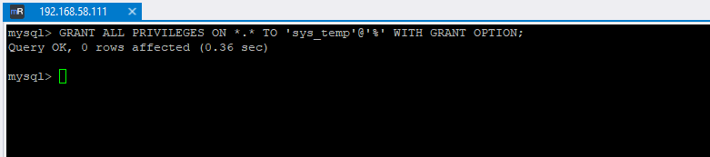

# Домашнее задание к занятию "`DDL/DML`" - `Дедюрин Денис`

---
## Задание 1
1.1. Поднимите чистый инстанс MySQL версии 8.0+. Можно использовать локальный сервер или контейнер Docker.

1.2. Создайте учётную запись sys_temp.

1.3. Выполните запрос на получение списка пользователей в базе данных. (скриншот)

1.4. Дайте все права для пользователя sys_temp.

1.5. Выполните запрос на получение списка прав для пользователя sys_temp. (скриншот)

1.6. Переподключитесь к базе данных от имени sys_temp.

Для смены типа аутентификации с sha2 используйте запрос:
```
ALTER USER 'sys_temp'@'localhost' IDENTIFIED WITH mysql_native_password BY 'password';
```

1.6. По ссылке https://downloads.mysql.com/docs/sakila-db.zip скачайте дамп базы данных.

1.7. Восстановите дамп в базу данных.

1.8. При работе в IDE сформируйте ER-диаграмму получившейся базы данных. При работе в командной строке используйте команду для получения всех таблиц базы данных. (скриншот)

Результатом работы должны быть скриншоты обозначенных заданий, а также простыня со всеми запросами.

### Ответ:

**1.1 Поднимаем инстанс MySQL с помощью docker-compose.yml:**
```
version: '3.8'

services:
  db:
    image: mysql:8.0
    container_name: mysql8
    environment:
      MYSQL_ROOT_PASSWORD: root
    ports:
      - "3306:3306"
    volumes:
      - db_data:/var/lib/mysql

volumes:
  db_data:
```

**Запускаем командой:**
```
docker compose up -d
```


**Подключаемся к MySQL серверу:**
```
docker exec -it $(docker compose ps -q db) mysql -u root -p
```


**1.2. Создаем учетную запись sys_temp и паролем password:**
```
CREATE USER 'sys_temp'@'%' IDENTIFIED BY 'password';
```


**1.3. Выполняем запрос на получение списка пользователей в базе данных.**
```
SELECT user, host FROM mysql.user;
```


**1.4. Даём все права для пользователя sys_temp.**
```
GRANT ALL PRIVILEGES ON *.* TO 'sys_temp'@'%' WITH GRANT OPTION;
```


**1.5. Выполните запрос на получение списка прав для пользователя sys_temp.**
```
SHOW GRANTS FOR 'sys_temp'@'%' \G
```


**1.6. Переподключитесь к базе данных от имени sys_temp.**

Для смены типа аутентификации с sha2 используйте запрос:
```
ALTER USER 'sys_test'@'192.168.58.111' IDENTIFIED WITH mysql_native_password BY 'password';
```
**1.7. Скачиваем дамп базы данных:**
```
wget https://downloads.mysql.com/docs/sakila-db.zip
```


**Распаковываем полученный архив:**
```
unzip sakila-db.zip
```


**1.8. Восстанавливаем базу данных из дампа.**

**Копируем файлы скриптов внутрь контейнера с MySQL:**
```
docker cp sakila-db/sakila-schema.sql $(docker compose ps -q db):/sakila-schema.sql
docker cp sakila-db/sakila-data.sql $(docker compose ps -q db):/sakila-data.sql
```


**Заходим внутрь контейнера с MySQL для выполнения импорта БД из скопированных скриптов:**
```
docker exec -it mysql8 bash
ls -al
```


```
mysql -u sys_temp -p < /sakila-schema.sql
mysql -u sys_temp -p < /sakila-data.sql
```


**1.9. ER-диаграмма и выборка всех таблиц базы данных.**


## Задание 2
Составьте таблицу, используя любой текстовый редактор или Excel, в которой должно быть два столбца: в первом должны быть названия таблиц восстановленной базы, во втором названия первичных ключей этих таблиц. Пример: (скриншот/текст)

```
Название таблицы | Название первичного ключа
customer         | customer_id
```
### Ответ:

| Название таблицы   | Название первичного ключа        |
|--------------------|----------------------------------|
| actor              | actor_id                         |
| film               | film_id                          |
| customer           | customer_id                      |
| inventory          | inventory_id                     |
| rental             | rental_id                        |
| payment            | payment_id                       |
| staff              | staff_id                         |
| store              | store_id                         |
| category           | category_id                      |
| film_category      | film_id, category_id             |
| language           | language_id                      |
| address            | address_id                       |
| city               | city_id                          |
| country            | country_id                       |
| customer_address   | customer_id, address_id         |